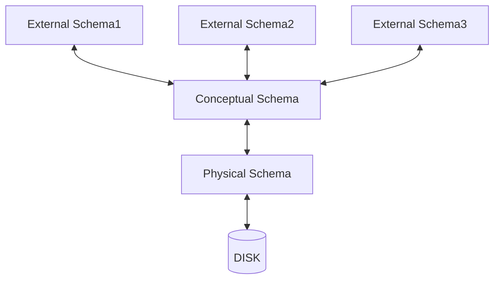

# 第一章 介绍

## 数据的描述和存储

**数据模型（data model）** 是一类描述数据顶层架构的模型。它们将数据的底层存储细节隐藏起来。

现今最广泛使用的数据模型是**关系模型（relational data model）**。

**语义模型（semantic data model）** 是一类更贴近人类直观认识的描述模型，被用于数据库设计阶段。**实体-联系模型（entity-relationship model）（ER）** 是一个被广泛使用的语义模型。

### 模式与实例

**模式（schema）**：数据模型对数据的描述。

**实例（instance）**：依照模式的定义，特定时刻存储在数据库中的具体数据。

模式与实例的关系，就是程序语言中 *变量声明* 与 *变量实例* 的关系。

### 关系模型

关系模型的核心结构是**关系（relation）**，即**记录（records）** 的集合。*一个关系对应一张表，一条记录对应表中的一行。*

关系模型中，一个关系的**模式**定义如下：

Students(*sid:* `string`, *name:* `string`, *login:* `string`, *age:* `integer`, *gpa:* `real`)

- `Students`是关系的名称；
- `sid`、`name`...是关系的**域（field）**，又称**属性（attribute）** 或**列（column）**；
- `string`、`integer`、`real`是域的格式。

Students关系的一个**实例**如下：

| sid   | name    | login         | age  | gpa  |
| ----- | ------- | ------------- | ---- | ---- |
| 53666 | Jones   | jones@cs      | 18   | 3.4  |
| 53688 | Smith   | smith@ee      | 18   | 3.2  |
| 53650 | Smith   | smith@math    | 19   | 3.8  |
| 53831 | Madayan | madayan@music | 11   | 1.8  |
| 53832 | Guldu   | guldu@music   | 12   | 2.0  |

对关系施加**完整性约束（integrity constraints）** 可以使其更加精确严格。

### DBMS的抽象层级

一个数据库的描述模式分布在三个抽象层级上：

- **物理层（physical level）**：最低层次的抽象，描述数据*实际上*是怎么存储的。
- **逻辑层（logical level）**：稍高层次的抽象，描述数据库中存储*什么*数据以及它们的联系。
- **视图层（view level）**：最高层次的抽象，只描述数据库的某个部分。

#### 概念模式（conceptual schema）

又称**逻辑模式（logical schema）**，存在于逻辑层。在关系型数据库中，概念模式描述数据库中的所有关系。一个例子如下：

Students(*sid:* `string`, *name:* `string`, *login:* `string`, *age:* `integer`, *gpa:* `real`)
Faculty(*fid:* `string`, *fname:* `string`, *sal:* `real`)
Courses(*cid:* `string`, *cname:* `string`, *credits:* `integer`)
Rooms(*rno:* `integer`, *address:* `string`, *capacity:* `integer`)
Enrolled(*sid:* `string`, *cid:* `string`, *grade:* `string`)
Teaches(*fid:* `string`, *cid:* `string`)
Meets_In(*cid:* `string`, *rno:* `integer`, *time:* `string`)

注意到不论**实体（entity）** 还是**联系（relationship）** 都被描述为一个**关系（relation）**。

#### 物理模式（physical schema）

在16章讨论

#### 外部模式（external schema）

存在于视图层，允许用户用定制化的方式访问他们所需的数据。一个外部模式由一组**视图（view）** 和关系组成。
视图从概念上讲也是关系，但并不实际存储在数据库中，而是根据定义，由一些关系计算而来。

### 数据独立性(data independence)

DBMS的分层设计能够提供三个层次间的隔离。

视图的使用者不需要关注他使用的视图是怎么计算出来的。如果逻辑模式的设计发生了变化，设计者只需重新设置视图的计算方式
